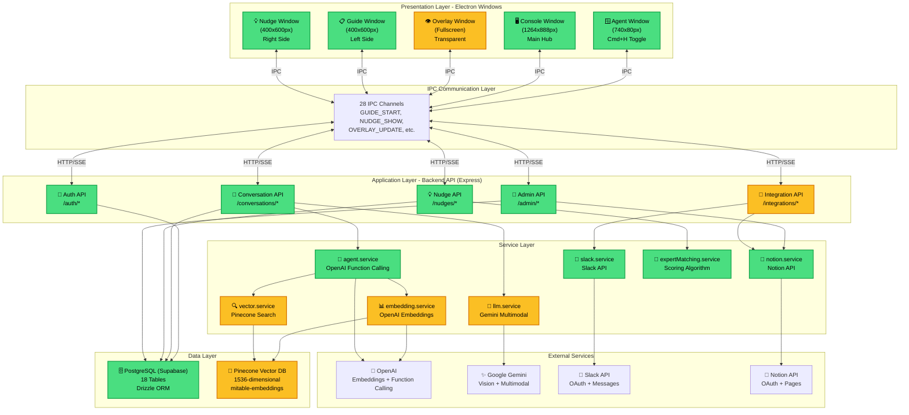
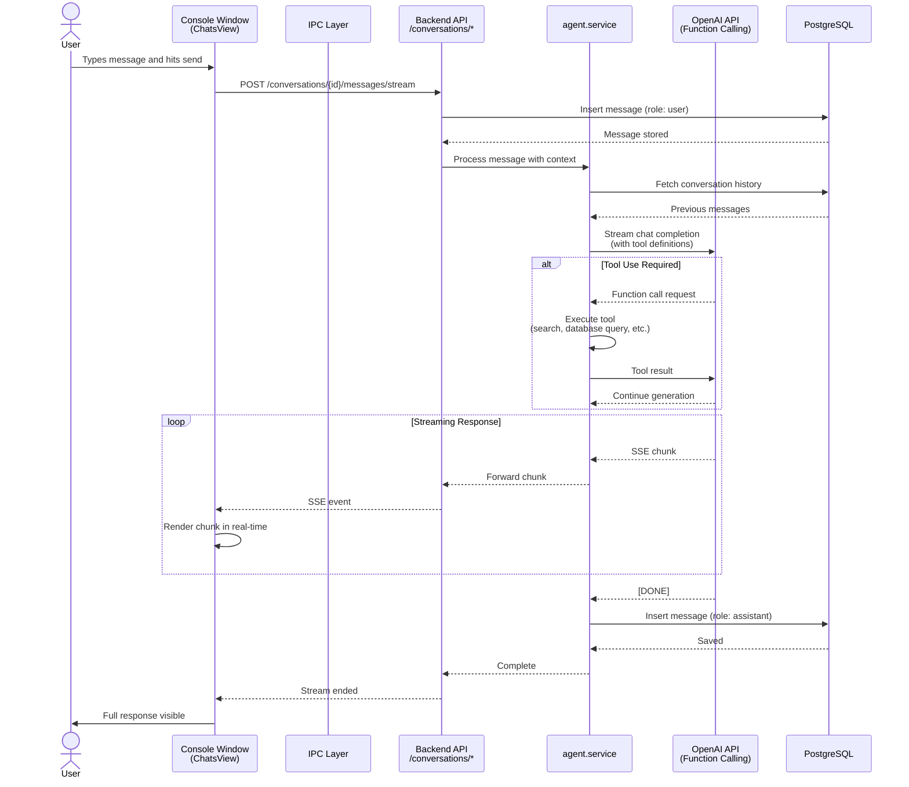
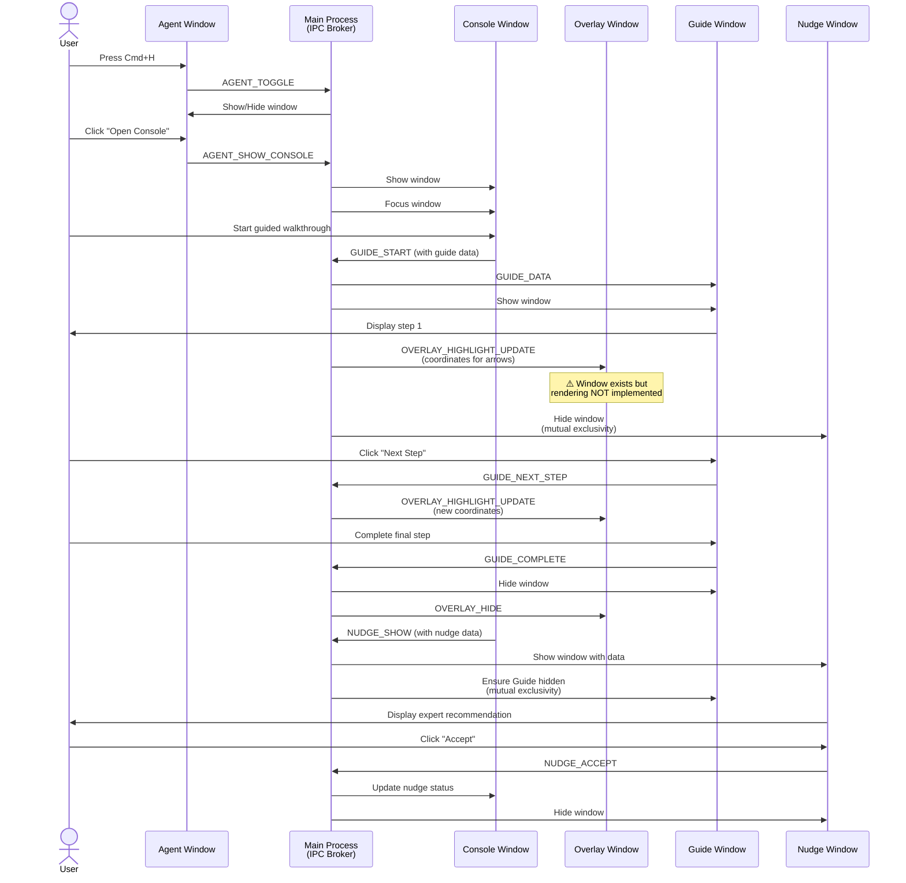
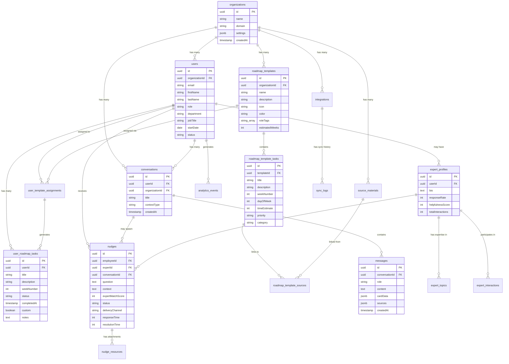
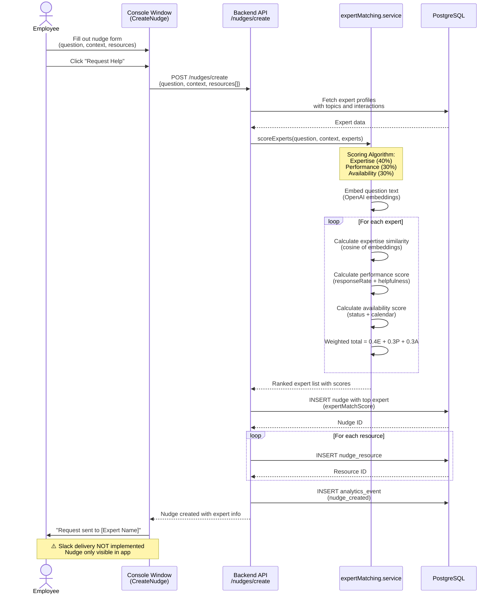
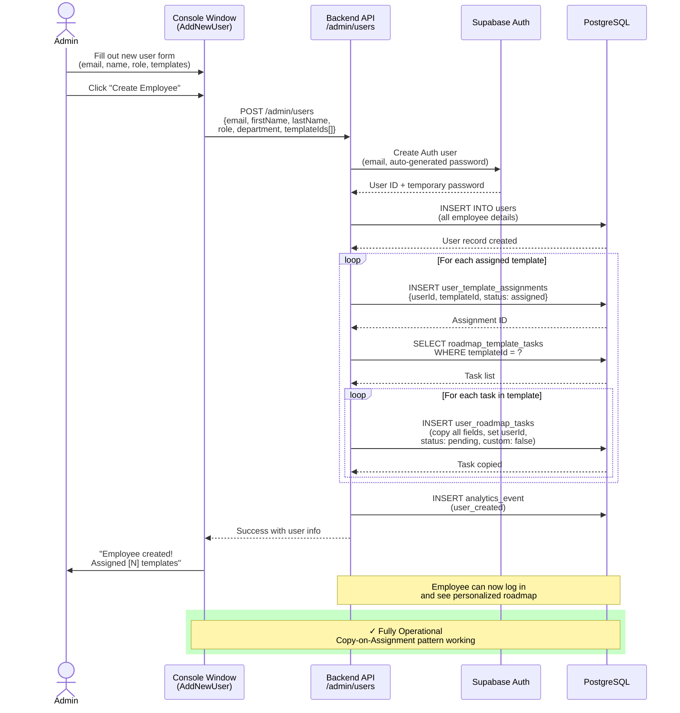
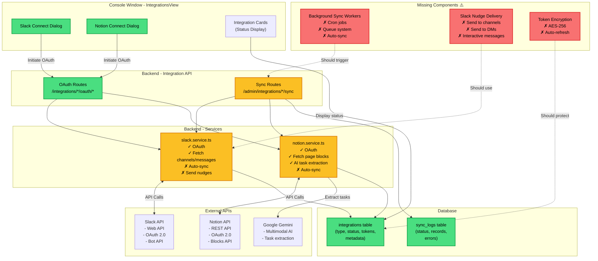
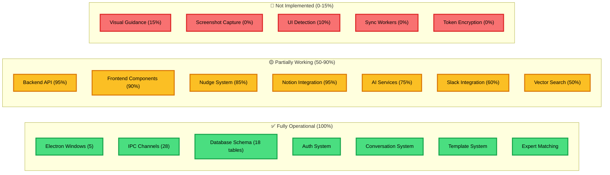
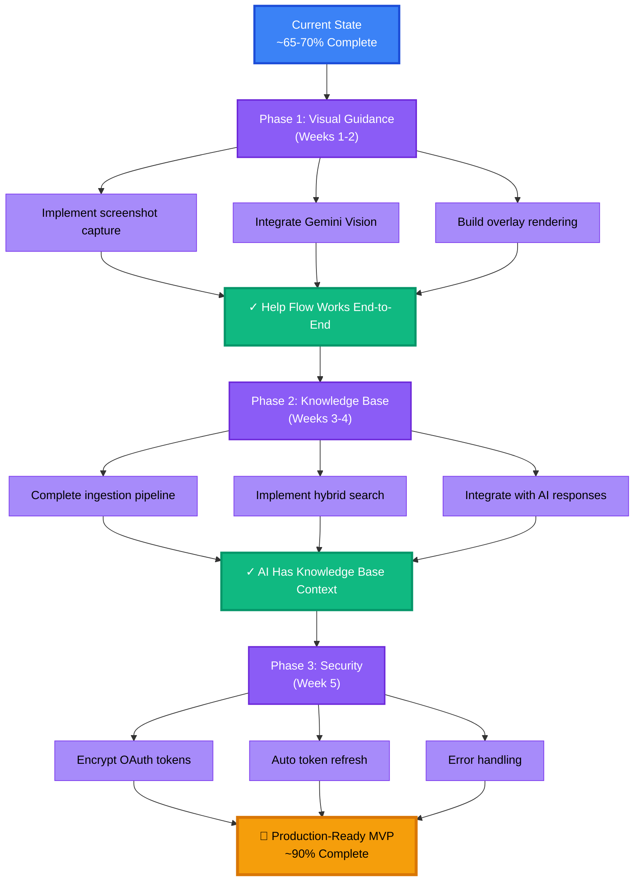

# Mitable AI Onboarding Buddy - Visual Architecture Diagrams

**Document Version:** 1.0
**Last Updated:** 2025-10-20
**Status:** Current implementation state (~65-70% complete)

This document provides Mermaid diagrams for the current implementation. These diagrams are fully compatible with GitHub, GitLab, and any modern markdown renderer that supports Mermaid.

---

## Table of Contents

1. [High-Level System Architecture](#1-high-level-system-architecture)
2. [Conversation Flow Sequence](#2-conversation-flow-sequence-diagram)
3. [Window Coordination via IPC](#3-window-coordination-via-ipc)
4. [Database Schema Relationships](#4-database-schema-relationships)
5. [Nudge Creation Flow](#5-nudge-creation-flow)
6. [Template Assignment Flow](#6-template-assignment-flow)
7. [Integration Architecture](#7-integration-architecture)

---

## 1. High-Level System Architecture

**Legend:**

- 🟢 Green = Fully implemented and operational
- 🟡 Yellow = Partially implemented
- 🔴 Red = Missing or non-functional

---

## 2. Conversation Flow Sequence Diagram

Shows the end-to-end flow when a user sends a message in the chat interface.

---

## 3. Window Coordination via IPC

Shows how the 5 Electron windows communicate via IPC channels.

---

## 4. Database Schema Relationships

Shows the relationships between the 18 PostgreSQL tables.

---

## 5. Nudge Creation Flow

Shows the complete flow when an employee creates a nudge requesting expert help.

---

## 6. Template Assignment Flow

Shows how an admin assigns an onboarding template to a new employee.

---

## 7. Integration Architecture

Shows how the system integrates with external services (Slack, Notion, etc.)

---

## Integration Status Summary

| Integration      | OAuth | Fetch Data          | Auto-Sync | Send Data | Status |
| ---------------- | ----- | ------------------- | --------- | --------- | ------ |
| **Slack**        | ✓     | ✓ Channels/Messages | ✗         | ✗ Nudges  | 60%    |
| **Notion**       | ✓     | ✓ Pages/Blocks      | ✗         | N/A       | 95%    |
| **GitHub**       | ~     | ✗                   | ✗         | ✗         | 10%    |
| **Google Drive** | ~     | ✗                   | ✗         | ✗         | 10%    |

---

## System Health Dashboard

---

## Critical Path to MVP

---

## Notes on Rendering

All diagrams in this document use Mermaid syntax and will render automatically on:

- **GitHub** - Native support in markdown files
- **GitLab** - Native support
- **VS Code** - With Mermaid Preview extension
- **Obsidian** - Native support
- **Notion** - Via Mermaid blocks
- **Confluence** - Via Mermaid macro

For local viewing, use any of these tools or visit [Mermaid Live Editor](https://mermaid.live/).

---

**Document Prepared:** 2025-10-20
**Diagrams Generated:** Based on actual codebase exploration
**Format:** Mermaid (CommonMark compatible)
