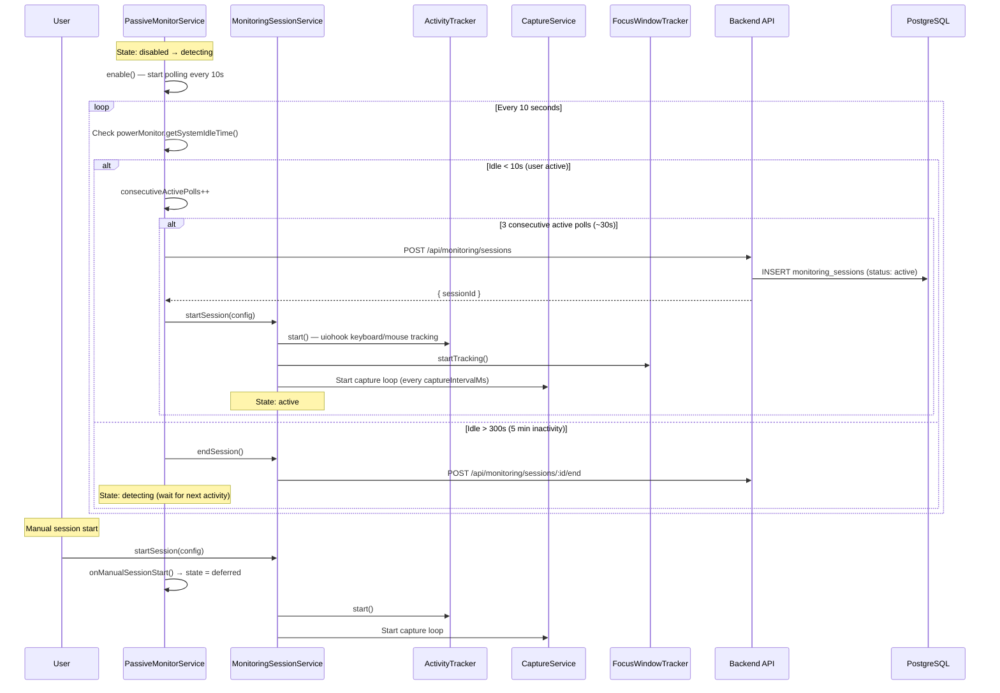

# 1. Passive Monitoring & Session Lifecycle

## Overview

Mitable has two ways to start a monitoring session:

1. **Manual (Focused)** — User clicks "Start Session" in the Console window
2. **Passive (Auto-detected)** — The system detects sustained user activity and automatically starts a session

Once started, sessions follow a lifecycle: `active` → `paused` → `active` → `summarizing` → `ready`. The desktop app captures screenshots periodically, tracks keyboard/mouse activity, and uploads frames to the backend for AI analysis.

## Trigger

- **Manual**: User clicks "Start Session" in the Console UI or WatchButton window
- **Passive**: `PassiveMonitorService` detects 30 seconds of sustained activity via Electron's `powerMonitor.getSystemIdleTime()`

## Flow Diagram



## Step-by-Step Walkthrough

### Passive Monitoring Startup

1. **App Launch** → `main.ts` calls `passiveMonitorService.enable(callbacks)`
2. **Polling starts** — Every 10 seconds, checks `powerMonitor.getSystemIdleTime()`
3. **Activity detection** — If idle time < 10 seconds, increments `consecutiveActivePolls`
4. **Session trigger** — After 3 consecutive active polls (~30s sustained activity), calls `callbacks.startSession()`
5. **Session creation** — `startSessionFromMain()` in `main.ts`:
   - Calls `POST /api/monitoring/sessions` to create backend session
   - Calls `monitoringSessionService.startSession(config)` with the returned `sessionId`

### Session Lifecycle

1. **Start** → `MonitoringSessionService.startSession(config)`
   - Initializes `ActiveSession` object with session ID, config, timestamps
   - Starts `ActivityTracker` (uiohook-napi) for keyboard/mouse/clipboard events
   - Starts `FocusWindowTracker` for active window detection
   - Begins periodic capture loop (`captureTimer` at `captureIntervalMs`)

2. **Capture Loop** (every `captureIntervalMs`, default from `SESSION_DEFAULTS`)
   - `CaptureService.captureWindows()` takes screenshots of tracked windows
   - SHA-256 hash computed per window for deduplication (`lastCaptureHashByWindow`)
   - New frames stored via `LocalFrameStorage`
   - Frames uploaded to backend via `POST /api/monitoring/sessions/:id/analyze-frame`

3. **Pause/Resume**
   - `POST /api/monitoring/sessions/:id/pause` — stops capture loop, records `pausedAt`
   - `POST /api/monitoring/sessions/:id/resume` — restarts capture loop, accumulates `totalPausedMs`

4. **End** → `POST /api/monitoring/sessions/:id/end`
   - Triggers the [Session End Processing](./04-session-end-processing.md) pipeline
   - Passive monitor returns to `detecting` state

### State Machine (PassiveMonitorService)

```
disabled ──enable()──> detecting ──sustained activity──> (session via MSS)
    ^                     ^                                    │
    │                     │                   5 min idle       │
    │                     └────────────────────────────────────┘
    │                     ^
    │  disable()          │ onManualSessionEnd()
    │                     │
    └─── deferred <──onManualSessionStart()── detecting
```

- **disabled**: Passive monitoring off
- **detecting**: Polling idle time, waiting for sustained activity
- **deferred**: A manual session is active; passive monitoring yields to it

## Data Stores

| Table                 | Purpose                                                      |
| --------------------- | ------------------------------------------------------------ |
| `monitoring_sessions` | Session metadata (status, timestamps, userId, orgId, goal)   |
| `session_captures`    | Individual frame records (image data, activity descriptions) |

## Key Files

| File                                                            | Purpose                                                |
| --------------------------------------------------------------- | ------------------------------------------------------ |
| `apps/electron/src/services/passiveMonitorService.ts`           | Passive activity detection state machine               |
| `apps/electron/src/services/monitoringSessionService.ts`        | Session lifecycle management, capture loop             |
| `apps/electron/src/services/activityTracker.ts`                 | Keyboard/mouse/clipboard event tracking (uiohook-napi) |
| `apps/electron/src/services/focusWindowTracker.ts`              | Active window change detection                         |
| `apps/electron/src/services/captureService.ts`                  | Screenshot capture via desktopCapturer                 |
| `apps/electron/src/services/localFrameStorage.ts`               | Persistent local frame storage with manifest           |
| `apps/electron/src/services/checkpointService.ts`               | Crash recovery checkpoints                             |
| `apps/electron/src/services/capturePolicy.ts`                   | App-level capture blocking policy                      |
| `apps/backend/src/domains/sessions/routes/monitoring.ts`        | Session CRUD API endpoints                             |
| `apps/backend/src/domains/sessions/schema/monitoring.schema.ts` | `monitoring_sessions` table definition                 |

## Configuration Constants

| Constant                  | Value                   | Location                   |
| ------------------------- | ----------------------- | -------------------------- |
| `POLL_INTERVAL_MS`        | 10,000 ms               | `passiveMonitorService.ts` |
| `IDLE_ACTIVE_THRESHOLD_S` | 10 seconds              | `passiveMonitorService.ts` |
| `START_CONSECUTIVE_POLLS` | 3 (~30s)                | `passiveMonitorService.ts` |
| `STOP_IDLE_THRESHOLD_S`   | 300 seconds (5 min)     | `passiveMonitorService.ts` |
| `captureIntervalMs`       | From `SESSION_DEFAULTS` | `@mitable/shared`          |
