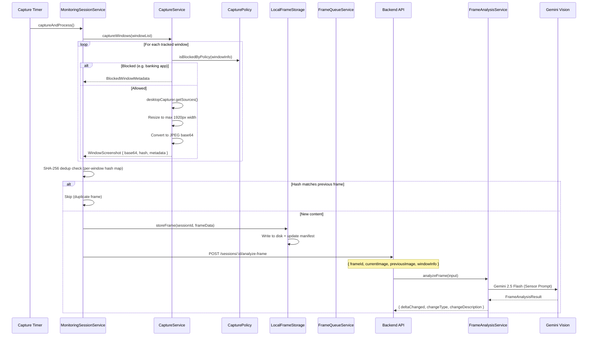

# 2. Screen Capture & Frame Analysis

## Overview

During an active session, the Electron app periodically captures screenshots of the user's monitored windows. Each frame goes through deduplication (SHA-256 hash), local storage, and is uploaded to the backend for AI-powered visual analysis using Gemini Vision.

## Trigger

- **Periodic**: Capture timer fires at `captureIntervalMs` intervals
- **Focus Change**: `FocusWindowTracker` detects the user switched windows
- **Manual**: User-initiated capture (rare)

## Flow Diagram

## Step-by-Step Walkthrough

### 1. Screenshot Capture (Electron)

**File**: `apps/electron/src/services/captureService.ts`

1. `captureWindows(windowList)` called by MonitoringSessionService
2. For each window in the list:
   - Check `capturePolicy.isBlockedByPolicy(windowInfo)` — skips banking, password managers, etc.
   - Call `desktopCapturer.getSources({ types: ['window', 'screen'] })` to get available sources
   - Match source to the target window by source ID
   - Capture the `NativeImage` thumbnail
   - Resize to fit max 1920px width (preserves aspect ratio)
   - Convert to JPEG buffer, then base64 string
   - Compute SHA-256 hash of the image data
3. Returns `MultiWindowCaptureResult` with screenshots and blocked window metadata

### 2. Deduplication (Electron)

**File**: `apps/electron/src/services/monitoringSessionService.ts`

1. For each captured frame, compare SHA-256 hash against `lastCaptureHashByWindow` map
2. If hash matches the previous frame for that window → skip (no visual change)
3. If new → update hash map, increment `captureCount`
4. Track `consecutiveEmptyCaptures` — if all windows produce duplicates for too long, log a warning

### 3. Local Storage (Electron)

**File**: `apps/electron/src/services/localFrameStorage.ts`

1. Write frame image to disk in session-specific directory
2. Update manifest file tracking all frames for the session
3. Used by `CheckpointService` for crash recovery — if the app crashes mid-session, frames can be recovered and re-uploaded

### 4. Frame Queue (Electron)

**File**: `apps/electron/src/services/frameQueueService.ts`

1. If the backend is unreachable, frames are queued in `frame-queue.json`
2. Queue persists to disk for crash recovery
3. Background processor retries every 30 seconds in batches of 10
4. Max 5 retries per frame before moving to failed queue

### 5. Upload to Backend

**Route**: `POST /api/monitoring/sessions/:id/analyze-frame`

**File**: `apps/backend/src/domains/sessions/routes/monitoring.ts`

Request body includes:

- `frameId` — unique frame identifier
- `currentImage` — base64 JPEG screenshot
- `previousImage` — base64 of the previous frame (null for first frame)
- `windowInfo` — `{ windowSourceId, appName, windowTitle }`
- `sequenceNumber` — frame sequence within session
- `captureTrigger` — `"periodic" | "focus_change" | "manual"`
- `intervalEvidence` — keyboard/mouse activity counts from ActivityTracker
- `browserContext` — active tab URL/title (from BrowserBridgeService)

## Data Stores

| Store                            | Purpose                                   |
| -------------------------------- | ----------------------------------------- |
| Local disk (`LocalFrameStorage`) | Temporary frame images + manifest         |
| `frame-queue.json`               | Offline queue for retry                   |
| `session_captures` (PostgreSQL)  | Frame records with metadata and imageData |

## AI Models

| Model                     | Purpose                       | Input                                     | Output                                                                               |
| ------------------------- | ----------------------------- | ----------------------------------------- | ------------------------------------------------------------------------------------ |
| Gemini 2.5 Flash (Vision) | Sensor — detect visual deltas | Current + previous frame as base64 images | `FrameAnalysisResult` (changeType, changeMagnitude, changeDescription, sceneContext) |

## Key Files

| File                                                                       | Purpose                                       |
| -------------------------------------------------------------------------- | --------------------------------------------- |
| `apps/electron/src/services/captureService.ts`                             | Screenshot capture, resize, format conversion |
| `apps/electron/src/services/capturePolicy.ts`                              | Blocked app detection (banking, passwords)    |
| `apps/electron/src/services/localFrameStorage.ts`                          | Persistent frame storage with manifest        |
| `apps/electron/src/services/frameQueueService.ts`                          | Offline queue with retry and crash recovery   |
| `apps/electron/src/services/focusWindowTracker.ts`                         | Window focus change detection                 |
| `apps/electron/src/services/browserBridgeService.ts`                       | Browser tab URL/title extraction              |
| `apps/backend/src/domains/capture/services/frame-analysis.service.ts`      | Sensor step — Gemini Vision delta detection   |
| `apps/backend/src/domains/capture/services/gemini-vision-frame.service.ts` | Gemini API wrapper                            |
| `apps/backend/src/domains/capture/services/screenshot.service.ts`          | Backend screenshot utilities                  |
