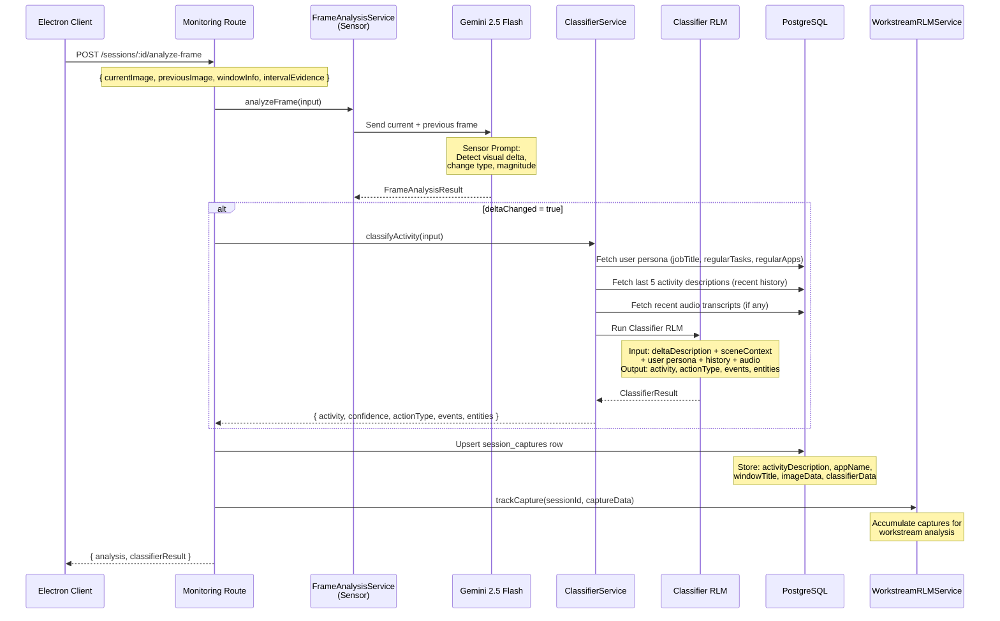

# 3. Activity Classification Pipeline

## Overview

Every captured frame goes through a two-step AI pipeline that transforms raw screenshots into structured activity descriptions. This is the core "Screen Understanding Pipeline":

1. **Sensor** (Step 1) — Gemini Vision compares consecutive frames to detect physical/visual changes (text input, scroll, window switch)
2. **Classifier** (Step 2) — An RLM agent interprets the visual delta into a meaningful work activity description, enriched with user persona and recent history context

The output (`activityDescription`) is stored on each `session_captures` row and becomes the input for all downstream processing (storyteller, block analyzer, recaps, benchmarks).

## Trigger

- Called by the `POST /api/monitoring/sessions/:id/analyze-frame` route
- Invoked from the Electron capture loop every time a non-duplicate frame is uploaded

## Flow Diagram



## Step-by-Step Walkthrough

### Step 1: Sensor (Frame Analysis)

**File**: `apps/backend/src/domains/capture/services/frame-analysis.service.ts`

**Purpose**: Detect purely visual/physical changes between consecutive frames. No semantic interpretation.

1. Receives `FrameAnalysisInput`:
   - `currentFrame` (base64) — the new screenshot
   - `previousFrame` (base64 or null) — the previous screenshot
   - `windowInfo` — app name, window title
   - `browserContext` — optional active tab URL/title

2. Sends both frames to **Gemini 2.5 Flash** with the `SENSOR_SYSTEM_PROMPT` + `SENSOR_USER_PROMPT`

3. Returns `FrameAnalysisResult`:
   - `deltaChanged: boolean` — whether anything visually changed
   - `changeType: ChangeType` — `"text_input" | "scroll" | "window_switch" | "click" | "navigation" | "none"`
   - `changeMagnitude: ChangeMagnitude` — `"major" | "minor" | "trivial"`
   - `changeDescription: string` — natural language description of what changed
   - `sceneContext: string` — description of the overall scene (participants, app state)
   - `confidence: number` — 0-1 confidence score
   - `signals: FrameSignals` — flags for blockers and outcomes

### Step 2: Classifier (Activity Classification)

**File**: `apps/backend/src/domains/sessions/services/classifier.service.ts`

**Purpose**: Interpret the visual delta into a meaningful work activity using user context.

1. **Fetch User Persona** from `users` table:
   - `jobTitle`, `regularTasks`, `regularApps`, `additionalContext`

2. **Fetch Recent History** — last 5 `activityDescription` values from `session_captures` for this session

3. **Fetch Audio Context** — recent transcripts from `session_transcripts` matching the capture timestamp (if audio capture is active)

4. **Run Classifier RLM** (`apps/backend/src/domains/sessions/rlm/classifier/`)
   - Input: delta description + scene context + user persona + history + interval evidence
   - Uses multi-provider fallback: Claude Haiku → GPT → DeepSeek

5. Returns `ClassifierResult`:
   ```typescript
   {
     activity: string;           // "Reviewing pull request #342 in GitHub"
     confidence: number;         // 0.85
     isContinuation: boolean;    // true if continuing previous activity
     actionType: "VIEWING" | "NAVIGATION" | "PASTING" | "AUTHORING" | "EDITING";
     events: ClassifierEvent[];  // Structured event log
     entities: { people: string[], systems: string[] };
     metrics: { messages_composed, links_opened, pastes_performed };
   }
   ```

### Step 3: Persist to Database

**File**: `apps/backend/src/domains/sessions/routes/monitoring.ts`

1. Upsert `session_captures` row with:
   - `activityDescription` — the classified activity text
   - `appName`, `windowTitle` — from window info
   - `imageData` — base64 screenshot (cleared after session end)
   - `classifierData` — full structured output (events, entities, metrics)
   - `deltaChangeDescription` — raw sensor output
   - `onTask` — whether the activity is on-task (relative to session goal)
   - `intervalEvidence` — keyboard/mouse activity counts

2. Trigger workstream tracking: `workstreamRLMService.trackCapture(sessionId, data)`

## Data Stores

| Table              | Fields Written                                                                                                                                                             |
| ------------------ | -------------------------------------------------------------------------------------------------------------------------------------------------------------------------- |
| `session_captures` | `activityDescription`, `appName`, `windowTitle`, `imageData`, `classifierData`, `deltaChangeDescription`, `onTask`, `intervalEvidence`, `sequenceNumber`, `captureTrigger` |

## AI Models

| Model                         | Step           | Purpose                                                    |
| ----------------------------- | -------------- | ---------------------------------------------------------- |
| Gemini 2.5 Flash (Vision)     | Sensor         | Compare two screenshots, detect visual delta               |
| Claude Haiku / GPT / DeepSeek | Classifier RLM | Interpret delta into meaningful activity with user context |

## Key Files

| File                                                                         | Purpose                                             |
| ---------------------------------------------------------------------------- | --------------------------------------------------- |
| `apps/backend/src/domains/capture/services/frame-analysis.service.ts`        | Sensor step — Gemini Vision delta detection         |
| `apps/backend/src/domains/capture/services/gemini-vision-frame.service.ts`   | Gemini API wrapper for vision calls                 |
| `apps/backend/src/domains/sessions/services/classifier.service.ts`           | Classifier orchestrator — fetches context, runs RLM |
| `apps/backend/src/domains/sessions/rlm/classifier/classifier-rlm.service.ts` | Classifier RLM service                              |
| `apps/backend/src/domains/sessions/rlm/classifier/classifier-rlm-prompts.ts` | Classifier prompts                                  |
| `apps/backend/src/domains/sessions/rlm/classifier/classifier-tools.ts`       | Classifier RLM tools                                |
| `apps/backend/src/domains/sessions/rlm/classifier/classifier-environment.ts` | Classifier RLM environment (state)                  |
| `apps/backend/src/prompts/session-prompts.ts`                                | Sensor system/user prompts                          |

## Important Design Decisions

- **Sensor is strictly visual** — it detects "text appeared in a text field" not "user is writing a Slack message". Semantic interpretation is the Classifier's job.
- **Classifier uses user persona** — a "Code review" activity looks different for an engineer vs. a designer.
- **isContinuation flag** — prevents the same ongoing activity from being logged as separate events on every frame.
- **Multi-provider fallback** — if Claude Haiku fails, falls back to GPT, then DeepSeek, ensuring classification always succeeds.
