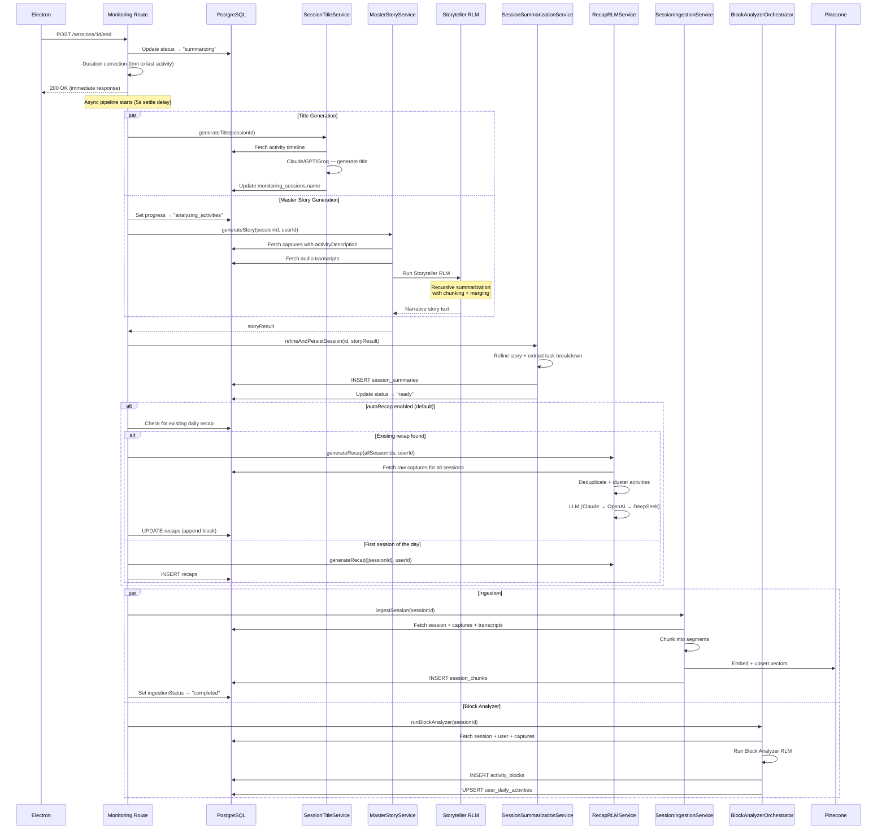

# 4. Session End Processing

## Overview

When a session ends (manually or via passive monitor timeout), a multi-step async pipeline runs to generate a human-readable narrative of what the user worked on. This is the most complex orchestration in the system, running multiple AI steps in parallel.

The pipeline produces:

- **Session Title** — AI-generated 3-6 word title (e.g., "Fixed authentication bug")
- **Master Story** — Narrative summary via the Storyteller RLM
- **Refined Summary** — Polished version with task breakdown
- **Daily Recap** — Rolling recap that accumulates all sessions from the same day
- **Ingested Chunks** — Embedded in Pinecone for agent search
- **Activity Blocks** — Structured blocks for the admin dashboard

## Trigger

- `POST /api/monitoring/sessions/:id/end` — called by Electron when user ends session or passive monitor detects inactivity

## Flow Diagram

## Step-by-Step Walkthrough

### 1. Request Handling

**File**: `apps/backend/src/domains/sessions/routes/monitoring.ts` (line ~714)

1. Verify session ownership
2. **Duration correction**: If gap between last capture and now > 5 minutes, trim `endedAt` to the last capture timestamp (prevents inflated duration when user walks away)
3. Calculate `activeDurationMs = endedAt - startedAt - totalPausedMs`
4. Clean up workstream RLM state: `workstreamRLMService.cleanupSession(id)`
5. Update session: `status = "summarizing"`, `summarizationProgress = "generating_title"`
6. Close any active audio WebSocket
7. **Short session guard**: If < 3 minutes or < 5 classified captures → skip storyteller, set status to "ready" with friendly message
8. Return 200 immediately, continue processing asynchronously

### 2. Title Generation (Async, Parallel)

**File**: `apps/backend/src/domains/sessions/services/session-title.service.ts`

1. Fetch all `activityDescription` values from `session_captures` for this session
2. Send to LLM with title-generation prompt (rules: < 6 words, active language, no generic titles)
3. Multi-provider fallback: Claude → OpenAI → Groq
4. Update `monitoring_sessions.name` with the generated title
5. Fallback to "Work session" if all providers fail

### 3. Master Story Generation (Async, Parallel with Title)

**File**: `apps/backend/src/domains/updates/services/master-story.service.ts`

1. Fetch activity timeline from `session_captures` (ordered by `sequenceNumber`)
2. Fetch audio transcripts from `session_transcripts`
3. Run **Storyteller RLM** (`apps/backend/src/domains/sessions/rlm/storyteller/`)
   - Recursive summarization: chunks large timelines, summarizes each chunk, then merges
   - Applies "Materiality Filter" — condenses 10 small actions into 1 meaningful update
   - Outputs concise bullet-point task summaries
4. Returns narrative story text

### 4. Summary Refinement & Persistence

**File**: `apps/backend/src/domains/sessions/services/session-summarization.service.ts`

1. `refineAndPersistSession(sessionId, rawStory)`:
   - Refines the raw story into polished markdown
   - Extracts structured task breakdown (title, duration, category per task)
   - Inserts into `session_summaries` table
   - Updates session status to "ready"
   - Updates `summarizationProgress` to null

### 5. Daily Recap Generation

**File**: `apps/backend/src/domains/updates/services/recap-rlm.service.ts`

1. Check for existing recap on the session's calendar day
2. If exists: append new session block, regenerate recap from all session IDs in the day
3. If new day: create fresh recap from single session
4. **Recap RLM Pipeline**:
   - Fetch raw `session_captures` classifications for all session IDs
   - Deduplicate & cluster consecutive similar activities
   - Build structured activity timeline
   - Send to LLM: Claude Haiku → OpenAI → DeepSeek V3.2
   - Graph context: `graphContextBuilderService` enriches with knowledge graph data
5. Store in `recaps` table with blocks array and total duration

### 6. Session Ingestion (Parallel with Block Analyzer)

**File**: `apps/backend/src/domains/sessions/services/session-ingestion.service.ts`

1. Fetch session, captures, summary, and transcripts
2. Check for existing chunks (idempotency)
3. Chunk session data via `SessionChunkingService`
4. Generate embeddings via `embeddingService` (OpenAI text-embedding-3-large, 1536 dims)
5. Upsert vectors into Pinecone
6. Insert `session_chunks` rows in PostgreSQL
7. Update `ingestionStatus = "completed"`

### 7. Block Analyzer (Parallel with Ingestion)

See [Activity Materialization](./05-activity-materialization.md) for full details.

## Data Stores

| Table                   | Purpose                                          |
| ----------------------- | ------------------------------------------------ |
| `monitoring_sessions`   | Status updates, title, summarizationProgress     |
| `session_summaries`     | Narrative summary, task breakdown                |
| `recaps`                | Daily recap content, blocks array                |
| `session_chunks`        | Embedded text chunks                             |
| Pinecone                | Vector embeddings for search                     |
| `activity_blocks`       | Structured activity blocks (from Block Analyzer) |
| `user_daily_activities` | Daily aggregate stats (from Block Analyzer)      |

## AI Models

| Model                            | Step               | Purpose                                   |
| -------------------------------- | ------------------ | ----------------------------------------- |
| Claude / GPT / Groq              | Title              | Generate 3-6 word session title           |
| Claude Haiku → GPT → DeepSeek    | Storyteller RLM    | Narrative summary generation              |
| Claude Haiku → GPT → DeepSeek    | Summary Refinement | Polish story + extract task breakdown     |
| Claude Haiku → OpenAI → DeepSeek | Recap RLM          | Generate daily recap from raw captures    |
| OpenAI text-embedding-3-large    | Ingestion          | Generate 1536-dim embeddings for Pinecone |
| Claude Haiku → GPT → DeepSeek    | Block Analyzer RLM | Structured activity classification        |

## Key Files

| File                                                                                | Purpose                               |
| ----------------------------------------------------------------------------------- | ------------------------------------- |
| `apps/backend/src/domains/sessions/routes/monitoring.ts`                            | Session end orchestrator (line ~714)  |
| `apps/backend/src/domains/sessions/services/session-title.service.ts`               | AI title generation                   |
| `apps/backend/src/domains/updates/services/master-story.service.ts`                 | Storyteller RLM narrative             |
| `apps/backend/src/domains/sessions/rlm/storyteller/`                                | Storyteller RLM (prompts, tools, env) |
| `apps/backend/src/domains/sessions/services/session-summarization.service.ts`       | Refine + persist                      |
| `apps/backend/src/domains/updates/services/recap-rlm.service.ts`                    | Daily recap RLM                       |
| `apps/backend/src/domains/sessions/services/session-ingestion.service.ts`           | Chunk + embed + Pinecone              |
| `apps/backend/src/domains/sessions/services/block-analyzer-orchestrator.service.ts` | Block Analyzer                        |

## Error Handling

- If storyteller fails, the session still transitions to "ready" status
- A fallback recap is generated from raw classifications even when story generation fails
- Ingestion and Block Analyzer run independently — one failing doesn't block the other
- If Block Analyzer fails, falls back to `classifySession()` → `materializeSession()` (lightweight pipeline)
