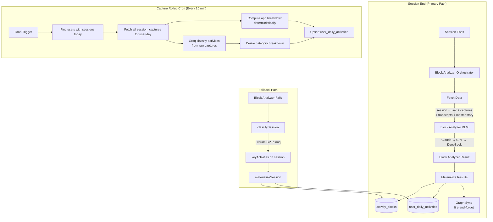

# 5. Activity Materialization & Daily Rollup

## Overview

Activity materialization converts raw session data into structured activity blocks and aggregated daily stats. This powers the admin dashboard, time insights, and benchmark scoring. There are two paths:

1. **Block Analyzer RLM** (primary) — Full agentic classification at session end
2. **Capture Rollup Cron** (lightweight) — Fast 10-minute rollup for near-real-time dashboard updates

Both write to the same tables: `activity_blocks` and `user_daily_activities`.

## Trigger

- **Session End**: Block Analyzer runs as part of the [Session End Processing](./04-session-end-processing.md) pipeline
- **Cron (10 min)**: Capture Rollup job provides lightweight, near-real-time daily stats
- **Fallback**: If Block Analyzer fails, `classifySession()` → `materializeSession()` runs instead

## Flow Diagram



## Step-by-Step Walkthrough

### Primary Path: Block Analyzer RLM

#### 1. Orchestrator

**File**: `apps/backend/src/domains/sessions/services/block-analyzer-orchestrator.service.ts`

`runBlockAnalyzer(sessionId)`:

1. **Fetch session metadata** — id, userId, orgId, timestamps, name, goal, finalSummary
2. **Fetch user profile** — name, jobTitle, regularTasks, regularApps
3. **Fetch session captures** — all captures with activityDescription, appName, windowTitle, classifierData, intervalEvidence
4. **Fetch audio transcripts** — if any exist for this session
5. **Fetch master story** — the latest session summary
6. **Fetch known customers** — for subscriber detection context
7. **Run Block Analyzer RLM** — multi-provider fallback (Claude Haiku → GPT-5 → DeepSeek)
8. **Materialize results** — write to `activity_blocks` + `user_daily_activities`
9. **Fire-and-forget**: Sync subscribers/topics to knowledge graph, discover new customers

#### 2. Block Analyzer RLM

**Files**: `apps/backend/src/domains/sessions/rlm/block-analyzer/`

- `block-analyzer-rlm.service.ts` — RLM runner
- `block-analyzer-environment.ts` — State/types for the RLM
- `block-analyzer-rlm-prompts.ts` — Prompts
- `block-analyzer-tools.ts` — Tool definitions

The RLM produces structured output:

```typescript
{
  blocks: [{
    blockType: "deep_work" | "meeting" | "communication" | "admin" | "break",
    name: string,          // "Code review on auth PR"
    description: string,
    startTime: string,
    endTime: string,
    category: string,      // "Engineering", "Communication"
    subscriber: string,    // Client/project name
    topic: string,         // Higher-level theme
    onTask: boolean,
  }],
  accomplishments: string[],
  dayNarrative: string,
}
```

#### 3. Materializer

**File**: `apps/backend/src/domains/sessions/services/block-analyzer-materializer.service.ts`

`materializeBlockAnalyzerResult(sessionId, result)`:

1. Insert each block into `activity_blocks` table
2. Upsert `user_daily_activities` for the session's date:
   - Recalculate `totalWorkMinutes`, `totalMeetingMinutes`
   - Update `categoryBreakdown` (Engineering, Communication, etc.)
   - Update `appBreakdown` (VS Code: 45min, Slack: 20min, etc.)
   - Update `topSubscribers`, `topTopics`
   - Merge `accomplishments` array
   - Set `processedSessionIds` (idempotency guard)

### Fallback Path: Classify + Materialize

#### classifySession()

**File**: `apps/backend/src/domains/sessions/services/session-classification.service.ts`

1. Fetch session captures + transcripts
2. Send to LLM (Claude → GPT → Groq) with classification prompt
3. Returns array of `ClassifiedActivity`:
   ```typescript
   {
     (activity, category, minutes, description, topic, subscriber);
   }
   ```
4. Writes result to `monitoring_sessions.keyActivities` (JSONB)

#### materializeSession()

**File**: `apps/backend/src/domains/sessions/services/activity-materializer.service.ts`

1. Read `keyActivities` from session
2. Convert each activity into an `activity_blocks` row
3. Normalize app names (e.g., "Slack Huddle" → "Slack")
4. Upsert `user_daily_activities` with recalculated aggregates
5. Sync subscribers/topics to graph (fire-and-forget)
6. Idempotency: checks `processedSessionIds` to skip already-materialized sessions

### Cron: Capture Rollup (Lightweight Layer 1)

**File**: `apps/backend/src/domains/sessions/cron/capture-rollup.job.ts`

Runs every 10 minutes. For each user with sessions today:

1. Read all `session_captures` (app names, activity descriptions, timestamps)
2. Compute app breakdown deterministically (app → minutes)
3. Call **Groq** (fast, cheap) to classify activities from raw capture data:
   - Output: activity name, category, duration (high-level, no narrative)
4. Derive category breakdown + meeting/work split from Groq output
5. Upsert `user_daily_activities` with lightweight stats

### Other Cron Jobs

| Job                | File                                   | Schedule | Purpose                                           |
| ------------------ | -------------------------------------- | -------- | ------------------------------------------------- |
| User Rollup        | `sessions/cron/user-rollup.job.ts`     | Periodic | Aggregate user-level stats                        |
| Org Rollup         | `sessions/cron/org-rollup.job.ts`      | Periodic | Aggregate org-level stats                         |
| Period Snapshot    | `sessions/cron/period-snapshot.job.ts` | Periodic | Snapshot daily activities for historical tracking |
| Inactivity Trigger | `sessions/cron/inactivity-trigger.ts`  | Periodic | Detect sessions needing end trigger               |

## Data Stores

| Table                   | Key Fields                                                                                                                                 |
| ----------------------- | ------------------------------------------------------------------------------------------------------------------------------------------ |
| `activity_blocks`       | `blockType`, `name`, `description`, `startTime`, `endTime`, `category`, `subscriber`, `topic`, `onTask`, `userId`, `sessionId`             |
| `user_daily_activities` | `date`, `userId`, `totalWorkMinutes`, `totalMeetingMinutes`, `categoryBreakdown`, `appBreakdown`, `accomplishments`, `processedSessionIds` |
| `monitoring_sessions`   | `keyActivities` (JSONB, used by fallback path)                                                                                             |

## AI Models

| Model                         | Path                       | Purpose                              |
| ----------------------------- | -------------------------- | ------------------------------------ |
| Claude Haiku → GPT → DeepSeek | Block Analyzer RLM         | Full agentic activity classification |
| Claude → GPT → Groq           | classifySession (fallback) | Lightweight activity classification  |
| Groq                          | Capture Rollup cron        | Fast near-real-time classification   |

## Key Files

| File                                                        | Purpose                                            |
| ----------------------------------------------------------- | -------------------------------------------------- |
| `sessions/services/block-analyzer-orchestrator.service.ts`  | Block Analyzer orchestrator                        |
| `sessions/rlm/block-analyzer/block-analyzer-rlm.service.ts` | Block Analyzer RLM                                 |
| `sessions/services/block-analyzer-materializer.service.ts`  | Write blocks + daily stats                         |
| `sessions/services/session-classification.service.ts`       | Fallback classification                            |
| `sessions/services/activity-materializer.service.ts`        | Fallback materialization                           |
| `sessions/cron/capture-rollup.job.ts`                       | 10-min lightweight rollup                          |
| `sessions/schema/daily-activities.schema.ts`                | `activity_blocks` + `user_daily_activities` tables |
