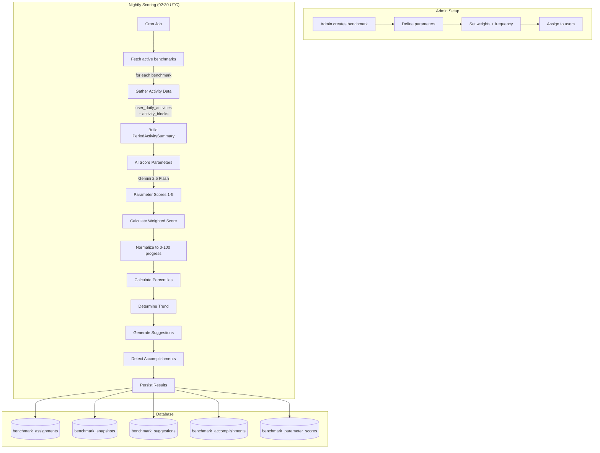

# 6. Benchmarks

## Overview

Benchmarks measure employee productivity through AI-scored parameters. Admins define benchmarks with custom parameters (e.g., "Deep Focus Time", "Collaboration Quality"), and the system scores each employee periodically using their activity data. Results include progress percentages, percentile rankings, trend analysis, and AI-generated suggestions.

## Trigger

- **Nightly Cron**: `benchmark-score.job.ts` runs at 02:30 UTC after activity data has settled
- **Manual**: Admin can trigger backfill via scripts
- **CRUD**: Admin creates/updates benchmarks and parameters via API

## Flow Diagram



## Step-by-Step Walkthrough

### 1. Cron Job

**File**: `apps/backend/src/domains/benchmarks/cron/benchmark-score.job.ts`

`runBenchmarkScoreJob(frequencies?)`:

1. Fetch all benchmarks where `isActive = true`
2. Optionally filter by frequency (daily/weekly/monthly/quarterly)
3. For each benchmark: call `benchmarkComputeService.computeScores(benchmarkId)`
4. Track processed/failed counts and total execution time

### 2. Score Computation

**File**: `apps/backend/src/domains/benchmarks/services/benchmark-compute.service.ts`

`computeScores(benchmarkId)`:

1. **Fetch benchmark** with parameters and assignments
2. **Determine scoring period** based on frequency:
   - daily = 1 day, weekly = 7 days, monthly = 30 days, quarterly = 90 days
3. **For each assigned user**:

   a. **Gather activity data** from `user_daily_activities` and `activity_blocks`:

   ```typescript
   PeriodActivitySummary {
     totalWorkMinutes, totalMeetingMinutes,
     deepFocusMinutes, collaborationMinutes,
     avgWorkPercentage, onTaskRate,
     uniqueAppsUsed, categoryBreakdown,
     accomplishmentCount, longestFocusBlockMinutes,
     contextSwitchCount, daysActive
   }
   ```

   b. **AI Parameter Scoring** — call `benchmarkAIService.scoreParameters()`
   - Each parameter scored 1-5 by Gemini with reasoning
   - Rule-based fallback if LLM unavailable

   c. **Weighted Score** — sum(score \* importance) / sum(importance)

   d. **Progress** — normalize to 0-100 scale: `(weightedScore / 5) * 100`

   e. **Percentiles** — compare against all users' scores in the same benchmark
   - Tiers: `top_1`, `top_10`, `top_25`, `top_50`, `bottom_half`

   f. **Trend** — compare current score to previous snapshot
   - `improving` (>5% up), `declining` (>5% down), `stable`, `new`

   g. **Suggestions** — AI-generated improvement tips based on lowest-scoring parameters

   h. **Accomplishments** — AI-detected achievements from activity data

4. **Persist results**:
   - Update `benchmark_assignments` (currentScore, progress, percentile, trend)
   - Insert `benchmark_snapshots` (historical record)
   - Insert `benchmark_suggestions` (if any)
   - Insert `benchmark_accomplishments` (if any)
   - Insert `benchmark_parameter_scores` (per-parameter scores)

### 3. AI Scoring

**File**: `apps/backend/src/domains/benchmarks/services/benchmark-ai.service.ts`

Uses **Gemini 2.5 Flash** for all AI operations:

- `scoreParameters(params, activitySummary, sessionContext, dayContext)` — Score each parameter 1-5
- `generateSuggestions(priorityParams)` — Improvement suggestions for lowest-scoring params
- `detectAccomplishments(activitySummary)` — Find notable achievements
- Every method has a **rule-based fallback** for when LLM is unavailable

## Data Stores

| Table                        | Purpose                                                    |
| ---------------------------- | ---------------------------------------------------------- |
| `benchmarks`                 | Benchmark definitions (name, frequency, isActive, orgId)   |
| `benchmark_parameters`       | Parameters to score (name, description, importance weight) |
| `benchmark_assignments`      | User-benchmark assignments with current scores             |
| `benchmark_snapshots`        | Historical score snapshots for trend analysis              |
| `benchmark_suggestions`      | AI-generated improvement suggestions                       |
| `benchmark_accomplishments`  | Detected achievements                                      |
| `benchmark_parameter_scores` | Per-parameter scores for each scoring period               |
| `user_daily_activities`      | Input data source for scoring                              |
| `activity_blocks`            | Input data source for detailed activity context            |

## AI Models

| Model            | Purpose                                                        |
| ---------------- | -------------------------------------------------------------- |
| Gemini 2.5 Flash | Score parameters, generate suggestions, detect accomplishments |

## API Routes

| Route                           | File                         | Purpose                         |
| ------------------------------- | ---------------------------- | ------------------------------- |
| `GET /api/benchmarks/my`        | `routes/my-benchmarks.ts`    | Employee's own benchmark scores |
| `GET /api/admin/benchmarks`     | `routes/admin-benchmarks.ts` | Admin benchmark management      |
| `POST /api/admin/benchmarks`    | `routes/admin-benchmarks.ts` | Create benchmark                |
| `PUT /api/admin/benchmarks/:id` | `routes/admin-benchmarks.ts` | Update benchmark                |

## Key Files

| File                                               | Purpose                                    |
| -------------------------------------------------- | ------------------------------------------ |
| `benchmarks/services/benchmark-compute.service.ts` | Core scoring engine                        |
| `benchmarks/services/benchmark-ai.service.ts`      | AI scoring + suggestions + accomplishments |
| `benchmarks/services/benchmark.service.ts`         | CRUD operations                            |
| `benchmarks/cron/benchmark-score.job.ts`           | Nightly cron job                           |
| `benchmarks/schema/benchmarks.schema.ts`           | All benchmark tables                       |
| `benchmarks/routes/my-benchmarks.ts`               | Employee-facing routes                     |
| `benchmarks/routes/admin-benchmarks.ts`            | Admin routes                               |
