# 7. Bragbook & Updates

## Overview

The Updates domain generates polished work summaries that employees can share in standups, reviews, or Slack. There are three main outputs:

1. **Daily Recaps** — Auto-generated at session end, accumulating all sessions from a day
2. **Bragbook Entries** — Hierarchical accomplishment summaries (weekly → monthly → quarterly)
3. **Day Analyzer** — Rich narrative with detailed blocks and accomplishments

## Trigger

- **Daily Recaps**: Auto-generated at session end (see [Session End Processing](./04-session-end-processing.md))
- **Bragbook**: Scheduled cron job or manual "Generate Now" button
- **Day Analyzer**: Cron job (30-minute schedule)

## Flow Diagram

```mermaid
flowchart TB
    subgraph DailyRecap["Daily Recap (Auto at Session End)"]
        SE[Session Ends] --> CHK{Existing recap<br/>for today?}
        CHK -->|Yes| APPEND[Append session block<br/>to existing recap]
        CHK -->|No| CREATE[Create new daily recap]
        APPEND --> REGEN[Regenerate recap content<br/>from ALL session IDs]
        CREATE --> GEN[Generate recap from<br/>single session]
        REGEN --> RRLM[Recap RLM]
        GEN --> RRLM
        RRLM --> |Claude → OpenAI → DeepSeek| RC[(recaps)]
    end

    subgraph Bragbook["Bragbook (Hierarchical)"]
        CRON[Cron / Manual] --> WK[Generate Weekly Entries]
        WK --> |Fetch sessions for week| WKG[Gemini 2.5 Flash]
        WKG --> WKE[(bragbook_entries<br/>type: weekly)]

        WKE --> MO[Generate Monthly Entry]
        MO --> |Aggregate weekly entries| MOG[Gemini 2.5 Flash]
        MOG --> MOE[(bragbook_entries<br/>type: monthly)]

        MOE --> QT[Generate Quarterly Entry]
        QT --> |Aggregate monthly entries| QTG[Gemini 2.5 Flash]
        QTG --> QTE[(bragbook_entries<br/>type: quarterly)]
    end

    subgraph DayAnalyzer["Day Analyzer RLM"]
        DA_CRON[Cron 30min] --> DA_FETCH[Fetch day's captures]
        DA_FETCH --> DA_RLM[Day Analyzer RLM]
        DA_RLM --> |Rich narrative + blocks| DA_UDA[Update user_daily_activities]
    end
```



## Step-by-Step Walkthrough

### Daily Recaps

**File**: `apps/backend/src/domains/updates/services/recap-rlm.service.ts`

`generateRecap(sessionIds, userId)`:

1. **Fetch raw captures** from `session_captures` for all provided session IDs
2. **Deduplicate & cluster** consecutive similar activities:
   - Group captures by app + activity similarity
   - Merge consecutive identical activities into time ranges
   - Calculate duration per cluster
3. **Build structured timeline** with `ActivityCluster` objects:
   ```typescript
   {
     (timeRange, startTime, endTime, app, activity, durationMinutes, frameCount, confidence);
   }
   ```
4. **Fetch session metadata** — name, goal, start/end times for each session
5. **Enrich with graph context** — `graphContextBuilderService` adds knowledge graph context
6. **Send to LLM** with recap prompt:
   - Provider chain: Claude Haiku → OpenAI → DeepSeek V3.2
   - Prompt asks for markdown recap with key accomplishments, time breakdown, highlights
7. Returns markdown recap content

**Storage**: Recap stored in `recaps` table with:

- `title` — e.g., "Daily Recap -- Apr 12" (multi-session) or session name (single)
- `content` — markdown recap text
- `blocks` — JSON array of session blocks `[{ id, startTime, endTime, duration, goal, title }]`
- `totalDuration` — sum of all block durations

### Bragbook Generation

**File**: `apps/backend/src/domains/updates/services/bragbook-generator.service.ts`

Hierarchical generation using **Gemini 2.5 Flash**:

#### Weekly Entries

1. Determine the current week's start/end dates
2. Fetch all sessions within the week
3. Fetch session summaries and activity data
4. Send to Gemini with bragbook prompt asking for:
   - Top accomplishments
   - Key metrics (hours worked, projects touched)
   - Skills demonstrated
5. Store as `bragbook_entries` with `periodType = "weekly"`

#### Monthly Entries

1. Identify all weekly entries within the month
2. Use `getWeeksInMonth(monthStart)` to find relevant week periods
3. Aggregate weekly entries into monthly summary via Gemini
4. Store as `bragbook_entries` with `periodType = "monthly"`

#### Quarterly Entries

1. Identify all monthly entries within the quarter
2. Aggregate monthly entries into quarterly summary via Gemini
3. Store as `bragbook_entries` with `periodType = "quarterly"`

### Bragbook Cron Job

**File**: `apps/backend/src/domains/updates/cron/bragbook-generate.job.ts`

Scheduled to run periodically. Triggers `bragbookGeneratorService` for all users who have new session data since last generation.

### Day Analyzer RLM

**Files**: `apps/backend/src/domains/updates/rlm/day-analyzer/`

- `day-analyzer-rlm.service.ts` — RLM service
- `day-analyzer-rlm-prompts.ts` — Day analysis prompts
- `day-analyzer-tools.ts` — Tool definitions
- `day-analyzer-environment.ts` — Environment state

Runs on a 30-minute cron schedule. Produces richer daily narratives with detailed blocks and accomplishments that supplement the capture rollup data.

## Data Stores

| Table                   | Purpose                                                |
| ----------------------- | ------------------------------------------------------ |
| `recaps`                | Daily recap content, blocks array, totalDuration       |
| `bragbook_entries`      | Accomplishment entries (weekly/monthly/quarterly)      |
| `user_daily_activities` | Day Analyzer enriches with narrative + accomplishments |
| `session_captures`      | Source data for recap generation                       |
| `session_summaries`     | Source data for bragbook generation                    |

## AI Models

| Model                            | Feature            | Purpose                                        |
| -------------------------------- | ------------------ | ---------------------------------------------- |
| Claude Haiku → OpenAI → DeepSeek | Recap RLM          | Generate daily recap from raw captures         |
| Gemini 2.5 Flash                 | Bragbook Generator | Generate hierarchical accomplishment summaries |
| Claude Haiku → GPT → DeepSeek    | Day Analyzer RLM   | Rich daily narrative with blocks               |

## API Routes

| Route                            | File                    | Purpose                |
| -------------------------------- | ----------------------- | ---------------------- |
| `GET /api/my/bragbook`           | `routes/my-bragbook.ts` | Fetch bragbook entries |
| `POST /api/my/bragbook/generate` | `routes/my-bragbook.ts` | Manual "Generate Now"  |

## Key Files

| File                                             | Purpose                                     |
| ------------------------------------------------ | ------------------------------------------- |
| `updates/services/recap-rlm.service.ts`          | Recap generation from raw captures          |
| `updates/services/bragbook-generator.service.ts` | Hierarchical bragbook generation            |
| `updates/services/master-story.service.ts`       | Storyteller narrative (used at session end) |
| `updates/rlm/day-analyzer/`                      | Day Analyzer RLM (prompts, tools, env)      |
| `updates/cron/bragbook-generate.job.ts`          | Scheduled bragbook generation               |
| `updates/schema/bragbook.schema.ts`              | Bragbook entries table                      |
| `updates/schema/recaps.schema.ts`                | Recaps table                                |
