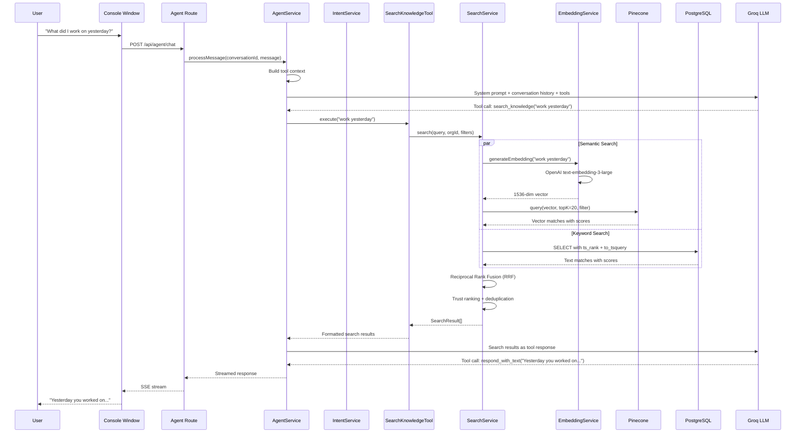

# 8. Agent & Knowledge Search

## Overview

The Agent is a conversational AI that answers employee questions about their work, company knowledge, and processes. It uses a hybrid search system combining:

1. **Semantic search** — Pinecone vector similarity (OpenAI embeddings, 1536 dimensions)
2. **Keyword search** — PostgreSQL full-text search (`tsvector`)
3. **Reciprocal Rank Fusion (RRF)** — Merges results from both sources

The agent draws from two knowledge bases:

- **Session data** — Embedded session chunks (what the user worked on)
- **Integration content** — Ingested Slack, Notion, GitHub data

## Trigger

- User sends a message in the Agent chat UI (Console window)
- `POST /api/agent/chat` or `POST /api/agent/ask`

## Flow Diagram

## Step-by-Step Walkthrough

### 1. Message Processing

**File**: `apps/backend/src/domains/agent/services/agent.service.ts`

1. Receive user message with conversation ID
2. Build tool context with available tools:
   - `SearchKnowledgeTool` — search company knowledge base
   - `RespondTextTool` — generate text responses
3. Send to **Groq** LLM with system prompt + conversation history + tool definitions
4. LLM decides which tools to call (agentic loop)
5. Stream response back to client via SSE

### 2. Knowledge Search

**File**: `apps/backend/src/domains/agent/services/search.service.ts`

`search(query, organizationId, filters, topK)`:

#### Semantic Search (Pinecone)

1. Generate embedding via `embeddingService.generateEmbedding(query)`
   - Model: OpenAI `text-embedding-3-large` (1536 dimensions)
2. Query Pinecone with:
   - Vector embedding
   - `topK` results (default 20)
   - Metadata filters (source, channels, date range)
3. Returns vector matches with cosine similarity scores

#### Keyword Search (PostgreSQL)

1. Query `search_content` table using `to_tsvector` / `to_tsquery`
2. Rank by `ts_rank` function
3. Apply same source/channel/date filters
4. Returns text matches with keyword relevance scores

#### Reciprocal Rank Fusion (RRF)

1. Merge results from both sources
2. RRF formula: `score = sum(1 / (k + rank))` where k = 60
3. Deduplicate by content ID
4. Apply trust ranking via `TrustRankingService`
5. Return top results with combined scores

### 3. Search Tools

**File**: `apps/backend/src/domains/agent/tools/search-knowledge.tool.ts`

The `SearchKnowledgeTool`:

- Receives query string from LLM
- Calls `searchService.search()`
- Formats results with source metadata (Slack channel, Notion page, session info)
- Returns formatted text for LLM to synthesize

**File**: `apps/backend/src/domains/agent/tools/respond-text.tool.ts`

The `RespondTextTool`:

- Receives text from LLM
- Streams it to the client
- Handles markdown formatting

### 4. Session Ingestion (Data Pipeline)

**File**: `apps/backend/src/domains/sessions/services/session-ingestion.service.ts`

When sessions are "ready", they're ingested into the search index:

1. Fetch session + captures + summary + transcripts
2. Chunk via `SessionChunkingService`:
   - Splits session data into overlapping text segments
   - Each chunk includes temporal context (timestamps)
3. Generate embeddings via `embeddingService`
4. Upsert into Pinecone with metadata (userId, orgId, sessionId, timestamps)
5. Store chunk records in `session_chunks` table

### 5. Trust Ranking

**File**: `apps/backend/src/domains/agent/services/trust-ranking.service.ts`

Applies trust-based re-ranking to search results:

- Recency boost — newer content scores higher
- Source quality — verified sources rank higher
- User relevance — content from user's own sessions boosted

### 6. Search Logging

**File**: `apps/backend/src/domains/agent/services/search-logger.service.ts`

Logs all search queries and results for analytics and quality improvement.

## Data Stores

| Store                         | Purpose                                             |
| ----------------------------- | --------------------------------------------------- |
| `conversations` (PostgreSQL)  | Conversation threads                                |
| `agent_chats` (PostgreSQL)    | Individual chat messages                            |
| `search_content` (PostgreSQL) | Ingested content with `tsvector` for keyword search |
| `session_chunks` (PostgreSQL) | Embedded session chunk metadata                     |
| `user_memories` (PostgreSQL)  | Agent memory of user preferences                    |
| Pinecone                      | Vector index for semantic search (1536 dims)        |

## AI Models

| Model                         | Purpose                                              |
| ----------------------------- | ---------------------------------------------------- |
| Groq (LLM)                    | Agent reasoning, tool selection, response generation |
| OpenAI text-embedding-3-large | Generate 1536-dim embeddings for queries and content |

## API Routes

| Route                          | File                  | Purpose                             |
| ------------------------------ | --------------------- | ----------------------------------- |
| `POST /api/agent/chat`         | `routes/agent.ts`     | Send message, get streamed response |
| `POST /api/agent/ask`          | `routes/agent.ts`     | Ask thread-based questions          |
| `GET /api/agent/conversations` | `routes/agent.ts`     | List conversations                  |
| `GET /api/agent/documents`     | `routes/documents.ts` | List ingested documents             |

## Key Files

| File                                             | Purpose                                  |
| ------------------------------------------------ | ---------------------------------------- |
| `agent/services/agent.service.ts`                | Agent loop, tool orchestration           |
| `agent/services/search.service.ts`               | Hybrid search (semantic + keyword + RRF) |
| `agent/services/intent.service.ts`               | Intent classification                    |
| `agent/services/memory.service.ts`               | User memory management                   |
| `agent/services/trust-ranking.service.ts`        | Result re-ranking                        |
| `agent/services/search-logger.service.ts`        | Search analytics                         |
| `agent/tools/search-knowledge.tool.ts`           | Search tool for LLM                      |
| `agent/tools/respond-text.tool.ts`               | Response streaming tool                  |
| `agent/tools/view-code.tool.ts`                  | Code viewing tool                        |
| `agent/agents/knowledge.agent.ts`                | Knowledge agent variant                  |
| `agent/rlm/`                                     | Agent query RLM (prompts, tools, env)    |
| `sessions/services/session-ingestion.service.ts` | Session chunking + embedding             |
| `sessions/services/session-chunking.service.ts`  | Text chunking logic                      |
| `shared-infra/services/embedding.service.ts`     | OpenAI embedding generation              |
| `shared-infra/services/vector.service.ts`        | Pinecone operations                      |
