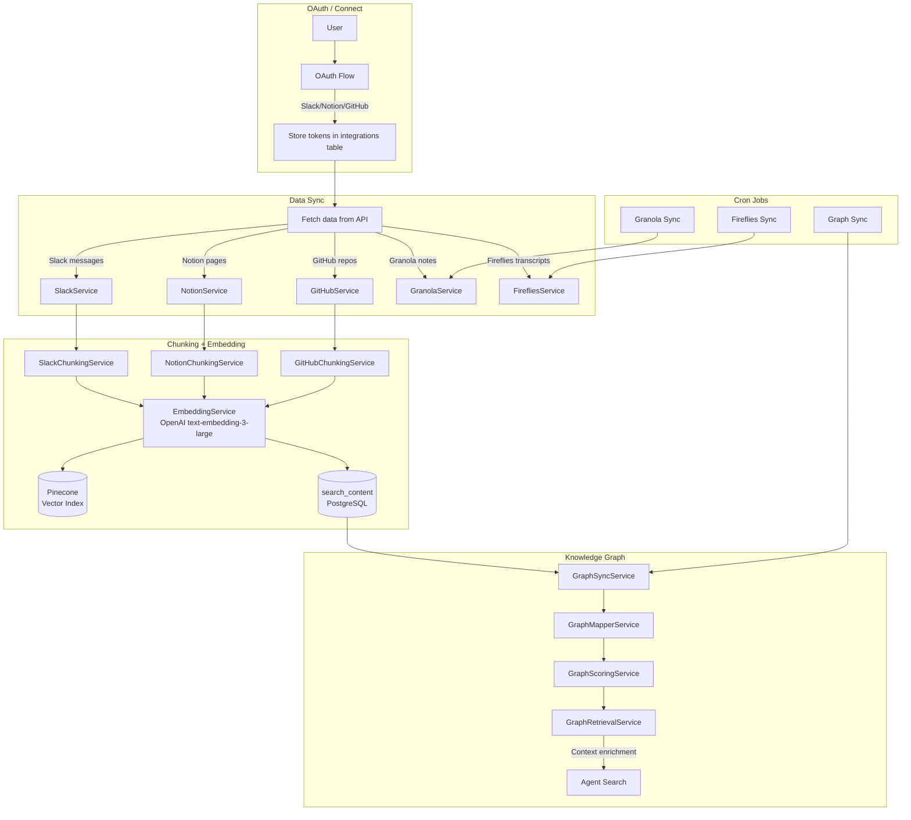

# 9. Integrations

## Overview

Mitable connects to external tools to build a comprehensive knowledge base. Each integration follows a common pattern: OAuth connect → sync data → chunk content → embed in Pinecone → store in PostgreSQL. The ingested content powers the Agent's knowledge search.

Supported integrations:

- **Slack** — Messages, threads, channels
- **Notion** — Pages, databases, documents
- **GitHub** — Repos, commits, issues, PRs, code snapshots
- **Granola** — Meeting notes (auto-sync via cron)
- **Fireflies** — Meeting transcripts (auto-sync via cron)
- **Linear** — Issues for session context (real-time)
- **Knowledge Graph** — Cross-integration entity and relationship graph
- **Gmail** — Email content
- **Google Docs** — Document export

## Trigger

- **OAuth Connect**: User authorizes integration in Console UI → triggers initial sync
- **Cron Jobs**: Granola (periodic), Fireflies (periodic), Graph sync (periodic)
- **Manual Sync**: User triggers re-sync from settings
- **Real-time**: Linear issue context passed per-session

## Flow Diagram

## Step-by-Step Walkthrough

### Slack Integration

**Files**: `apps/backend/src/domains/integrations/slack/`

1. **OAuth**: `slack.service.ts` handles OAuth flow, stores access token
2. **Fetch**: Pulls messages from selected channels via Slack API
3. **Chunk**: `slack-chunking.service.ts` splits messages into searchable chunks
   - Groups thread messages together
   - Preserves channel/user metadata
   - Creates text segments with context
4. **Ingest**: `slack-ingestion.service.ts` orchestrates embedding + storage
   - Generate embeddings via `embeddingService`
   - Upsert vectors into Pinecone with metadata (channelId, channelName, userId, username, messageUrl, messageTs)
   - Store in `search_content` table with `source = "slack"` and `tsvector` for keyword search

### Notion Integration

**Files**: `apps/backend/src/domains/integrations/notion/`

1. **OAuth**: `notion-user-oauth.service.ts` handles user-level OAuth
2. **Fetch**: `notion.service.ts` fetches pages and databases
3. **Chunk**: `notion-chunking.service.ts` splits page content into segments
   - Handles Notion block types (text, headings, lists, code, tables)
   - Preserves page hierarchy and metadata
4. **Ingest**: `notion-ingestion.service.ts` orchestrates embedding + storage
   - Metadata: pageId, pageTitle, pageUrl, lastEditedTime
5. **Export**: `notion-export.service.ts` exports Notion content to other formats

### GitHub Integration

**Files**: `apps/backend/src/domains/integrations/github/`

1. **Sync**: `github-sync.service.ts` syncs repo data (commits, issues, PRs)
2. **Ingest**: `github-ingestion.service.ts` processes and embeds content
3. **Chunk**: `github-chunking.service.ts` splits code and text content
4. **Code Snapshots**: `github-code-snapshot.service.ts` captures point-in-time code state
5. **Storage**: GitHub-specific tables:
   - `github_repos` — repository metadata
   - `github_commits` — commit history
   - `github_issues` — issue tracking
   - `github_pull_requests` — PR data

### Granola Integration

**Files**: `apps/backend/src/domains/integrations/granola/`

1. **Service**: `granola.service.ts` connects to Granola API
2. **Sync**: `granola-sync.service.ts` pulls meeting notes
3. **Cron**: `cron/granola-sync.job.ts` runs periodically

### Fireflies Integration

**Files**: `apps/backend/src/domains/integrations/fireflies/`

1. **Service**: `fireflies.service.ts` connects to Fireflies API
2. **Sync**: `fireflies-sync.service.ts` pulls meeting transcripts
3. **Cron**: `cron/fireflies-sync.job.ts` runs periodically

### Linear Integration

**File**: `apps/backend/src/domains/integrations/linear/linear.service.ts`

- Provides real-time issue context for sessions
- When a user starts a session, they can link a Linear issue
- `linearIssueId` and `linearIssueTitle` stored on `monitoring_sessions`
- Used by workstream detection (highest priority signal)

### Knowledge Graph

**Files**: `apps/backend/src/domains/integrations/graph/`

A relationship graph built from all ingested data:

1. **Graph Sync** (`graph-sync.service.ts`): Periodic sync of entities and relationships
   - `graph-incremental-sync.service.ts` for incremental updates
2. **Graph Mapper** (`graph-mapper.service.ts`): Maps content to graph entities
3. **Graph Scoring** (`graph-scoring.service.ts`): Ranks entities by relevance
4. **Graph Retrieval** (`graph-retrieval.service.ts`): Queries graph for context
5. **Graph Context Builder** (`graph-context-builder.service.ts`): Builds rich context for AI prompts
6. **Task Archetype Map** (`task-archetype-map.ts`): Maps tasks to standard archetypes

The graph enriches:

- Session summaries (master story, recaps)
- Agent search results
- Activity classification (subscriber/topic detection)

## Data Stores

| Table                  | Purpose                                                 |
| ---------------------- | ------------------------------------------------------- |
| `integrations`         | OAuth tokens, connection status, sync metadata          |
| `search_content`       | All ingested content with `tsvector` for keyword search |
| `github_repos`         | GitHub repository metadata                              |
| `github_commits`       | Commit history                                          |
| `github_issues`        | Issue data                                              |
| `github_pull_requests` | PR data                                                 |
| `graph_sync_*`         | Knowledge graph entities and relationships              |
| Pinecone               | Vector embeddings for semantic search                   |

## Cron Jobs

| Job            | File                         | Purpose                         |
| -------------- | ---------------------------- | ------------------------------- |
| Granola Sync   | `cron/granola-sync.job.ts`   | Sync meeting notes from Granola |
| Fireflies Sync | `cron/fireflies-sync.job.ts` | Sync transcripts from Fireflies |
| Graph Sync     | `cron/graph-sync.job.ts`     | Rebuild/update knowledge graph  |

## AI Models

| Model                         | Purpose                                               |
| ----------------------------- | ----------------------------------------------------- |
| OpenAI text-embedding-3-large | Generate 1536-dim embeddings for all ingested content |

## API Routes

| Route                                   | File                     | Purpose             |
| --------------------------------------- | ------------------------ | ------------------- |
| `POST /api/integrations/slack/connect`  | `routes/integrations.ts` | Slack OAuth         |
| `POST /api/integrations/notion/connect` | `routes/integrations.ts` | Notion OAuth        |
| `POST /api/integrations/github/connect` | `routes/integrations.ts` | GitHub OAuth        |
| `GET /api/integrations`                 | `routes/integrations.ts` | List connections    |
| `POST /api/integrations/:id/sync`       | `routes/integrations.ts` | Trigger manual sync |

## Key Files

| File                                                  | Purpose                    |
| ----------------------------------------------------- | -------------------------- |
| `integrations/slack/slack.service.ts`                 | Slack OAuth + API          |
| `integrations/slack/slack-chunking.service.ts`        | Slack content chunking     |
| `integrations/slack/slack-ingestion.service.ts`       | Slack embedding + storage  |
| `integrations/notion/notion.service.ts`               | Notion API wrapper         |
| `integrations/notion/notion-chunking.service.ts`      | Notion content chunking    |
| `integrations/notion/notion-ingestion.service.ts`     | Notion embedding + storage |
| `integrations/github/github.service.ts`               | GitHub API wrapper         |
| `integrations/github/github-sync.service.ts`          | GitHub data sync           |
| `integrations/github/github-ingestion.service.ts`     | GitHub embedding + storage |
| `integrations/granola/granola-sync.service.ts`        | Granola meeting sync       |
| `integrations/fireflies/fireflies-sync.service.ts`    | Fireflies transcript sync  |
| `integrations/linear/linear.service.ts`               | Linear issue context       |
| `integrations/graph/graph-sync.service.ts`            | Knowledge graph sync       |
| `integrations/graph/graph-context-builder.service.ts` | Context enrichment         |
| `integrations/routes/integrations.ts`                 | Integration API routes     |
| `integrations/schema/integrations.schema.ts`          | Integration tables         |
| `integrations/schema/search-content.schema.ts`        | Search content table       |
