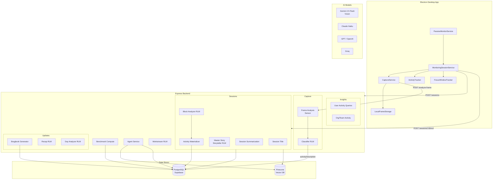

# Mitable Feature Documentation

End-to-end documentation for every major feature in the Mitable platform. Each doc covers the full data flow from trigger to storage, including services, functions, AI models, and database tables involved.

## Features

| #   | Feature                                                                     | Description                                                        |
| --- | --------------------------------------------------------------------------- | ------------------------------------------------------------------ |
| 1   | [Passive Monitoring & Session Lifecycle](./01-passive-monitoring.md)        | Auto-detection of user activity, session start/pause/resume/end    |
| 2   | [Screen Capture & Frame Analysis](./02-screen-capture.md)                   | Screenshot capture, deduplication, local storage, and upload       |
| 3   | [Activity Classification Pipeline](./03-activity-classification.md)         | Sensor (Gemini Vision) + Classifier (RLM) per-frame analysis       |
| 4   | [Session End Processing](./04-session-end-processing.md)                    | Title generation, Master Story, summary refinement, daily recap    |
| 5   | [Activity Materialization & Daily Rollup](./05-activity-materialization.md) | Block Analyzer RLM, activity blocks, daily stats, cron rollups     |
| 6   | [Benchmarks](./06-benchmarks.md)                                            | AI-scored productivity benchmarks with percentiles and trends      |
| 7   | [Bragbook & Updates](./07-bragbook-updates.md)                              | Hierarchical accomplishment generation (weekly/monthly/quarterly)  |
| 8   | [Agent & Knowledge Search](./08-agent-knowledge-search.md)                  | Conversational AI agent with hybrid vector + keyword search        |
| 9   | [Integrations](./09-integrations.md)                                        | Slack, Notion, GitHub, Granola, Fireflies, Linear, Knowledge Graph |
| 10  | [Workstream Detection](./10-workstream-detection.md)                        | Heuristic + RLM-based workstream grouping and aggregation          |

## Architecture Overview

## Shared Infrastructure

All features depend on these foundational services in `apps/backend/src/domains/shared-infra/`:

| Service           | File                                | Purpose                                               |
| ----------------- | ----------------------------------- | ----------------------------------------------------- |
| LLM Service       | `services/llm.service.ts`           | Multi-provider LLM fallback (Claude → GPT → DeepSeek) |
| Embedding Service | `services/embedding.service.ts`     | OpenAI text-embedding-3-large (1536 dims)             |
| Vector Service    | `services/vector.service.ts`        | Pinecone CRUD operations                              |
| Cache Service     | `services/cache.service.ts`         | In-memory caching layer                               |
| Chunking Service  | `services/chunking.service.ts`      | Text chunking for embeddings                          |
| PII Redaction     | `services/pii-redaction.service.ts` | Sensitive data masking                                |
| Logger            | `lib/logger.ts`                     | Pino-based structured logging                         |
| Session Logger    | `lib/sessionLogger.ts`              | Session-scoped logging with checkpoints               |
| Base RLM Runner   | `services/base-rlm-runner.ts`       | Standardized multi-provider LLM fallback loop         |
